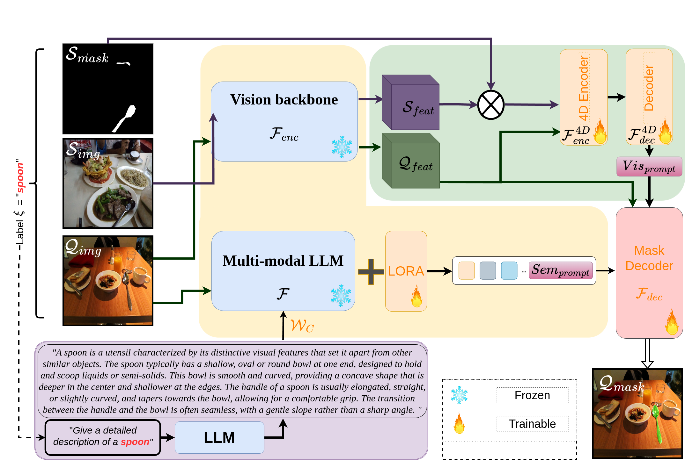
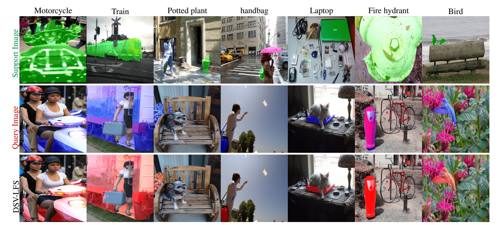

**DSV-LFS: Unifying LLM-Driven Semantic Cues with Visual Features for Robust
Few-Shot Segmentation** <br />
<br />


<p align="center">  </p>

## Abstract
Few-shot semantic segmentation (FSS) aims to enable
models to segment novel/unseen object classes using only
a limited number of labeled examples. However, current
FSS methods frequently struggle with generalization due to
incomplete and biased feature representations, especially
when support images do not capture the full appearance
variability of the target class. To supplement the FSS
pipeline, we propose a novel framework that leverages large
language models (LLMs) to encode class semantic information, combined with dense pixel-wise matching to capture
the similarity between query and support images, thereby
improving FSS performance. Inspired by reasoning-based
segmentation frameworks , our method, named DSV-LFS,
introduces an additional token into the LLM vocabulary, allowing a multimodal LLM to generate a ”semantic prompt”
from class descriptions. In parallel, a dense matching module identifies visual similarities between the query and support images, generating a ”visual prompt”. These prompts
are then jointly employed to guide the mask decoder for accurate segmentation of the query image. Comprehensive experiments on the benchmark datasets Pascal-5
i and COCO20i demonstrate that our framework achieves state-of-theart performance-by a significant margin-with superior generalization to novel classes and robustness across diverse
scenarios.


## Experimental results
<p align="center">  </p>

## Installation
```
Check requirements.txt file for packages
```

## &#x1F527;Get Started
**Just follow these steps to train and test DSV-LFS.**
### Dataset 
**1.** Download the dataset from the following links.
+ PASCAL-5<sup>i</sup>: [PASCAL VOC 2012](http://host.robots.ox.ac.uk/pascal/VOC/voc2012/) + [SBD](http://home.bharathh.info/pubs/codes/SBD/download.html)
+ COCO-20<sup>i</sup>: [MSCOCO2014](https://cocodataset.org/#download)

#### SAM ViT-H weights
Download SAM ViT-H pre-trained weights from the [link](https://dl.fbaipublicfiles.com/segment_anything/sam_vit_h_4b8939.pth).

#### llava-v1.5-7b
Download llava-v1.5-7b modek from the [link](https://huggingface.co/liuhaotian/llava-v1.5-7b).

### Training
```
deepspeed  train_ds.py \
  --version="PATH_TO_llava-v1.5-7b" \
  --dataset_dir='./dataset' \
  --vision_pretrained="PATH_TO_SAM" \
  --benchmark= "pascal" or "coco" \
  --fold="0" \
  --exp_name="name"\
  --shot="1" \
```
### Inference
```
deepspeed  train_ds.py \
  --version="PATH_TO_llava-v1.5-7b" \
  --dataset_dir='./dataset' \
  --vision_pretrained="PATH_TO_SAM" \
  --benchmark= "pascal" or "coco" \
  --fold="0" \
  --exp_name="name"\
  --shot="1" or "5" \
  --eval_only="True" \
```

